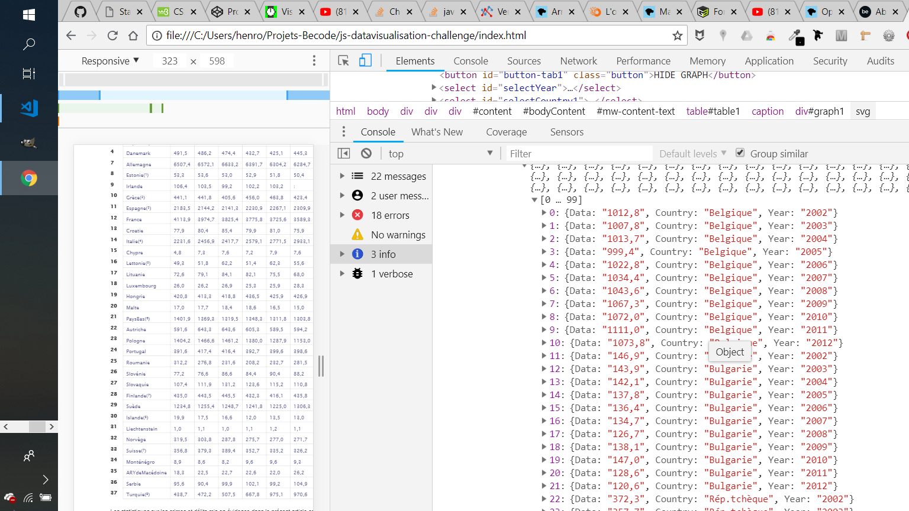

# Challenge JavaScript
<p style="text-align: center;">

</p>


- **Author:** Paul *"makemyA"* Henrot
- **About:** Génerer un graphique interactif
- **Period:** *-Start: 09/07/2018-*
- **Place:** [BeCode](https://becode.org/) bootcamp @[Becentral](https://www.becentral.org/) buildings in Bruxelles

You can watch complete instructions [there](https://github.com/becodeorg/lovelace-2/tree/master/Projects/javascript-challenge-solo)


You can watch the result [here](https://makemya.github.io/js-datavisualisation-challenge/)


## Project Description

* **Objective?**

    * Initiation aux programme dimple, d3
    * Introduction au backend
    * Générer un tableau sur base de données provenant du dom en utilisant uniquement avec javascript
    * 


* **Outils**

Le travail a été produit avec les langages et outils suivants: 

1. [Dimple] pour "printer" les graphiques
2. visual studio code pour l'éditeur de code
3. javascript pour récupérer les données, modifier le dom et générer les requêtes


## **Step 1:** Récupération des données

* Voyage dans l'enfer du dom

Les données devant servir aux tableaux se trouvent directement dans le dom. L'exercice simule une demande d'un client qui n'aurait pas de fichier de bases de données.

La première étape consiste à récupérer les données pour créer une base de donnée exploitable dans le style d'un fichier Json typique. Cette partie est de loin la plus difficile du travail. Afin de respecter les consignes à la lettre le seul outil utilisé pour l'exercice est le langage javascript.

* Création du tableaux de données

Voici le tableau:
<p style="text-align: center;">

</p>

et son code:

```javascript
//Générer le tableau de données à partir du fichier html
let tabGlobal=[];
let tabYears=[];
let tabDatas=[];
let tabCountries=[];
let table1 = document.getElementById("table1");
let years= table1.getElementsByTagName("tr")[1].getElementsByTagName("th");
let rows = table1.querySelectorAll("tr>td");
let countries = table1.querySelectorAll("th+td");
/* console.log(countries.length); */

for (let i =2; i<years.length;i++){
    tabYears.push(years[i].textContent);
}
for (let i=0; i<countries.length;i++){
   /*  console.log(countries[i].textContent); */
    tabCountries.push(countries[i].textContent);
}
        for (let i=0; i<rows.length;i++){
       
        tabDatas.push(rows[i].textContent);
        
       /*  console.log(typeof(rows[i].innerHTML)); */
        
    }
let regex= /^[a-zA-Z]/;//Créé une fonction qui vérifie si l'élément commence par une lettre majuscule ou minuscule"
let regex1= /^[:]/; //selectionne toutes les données comportant ":";
  
    for(let i=0; i<tabDatas.length;i++){
        let result =regex.test(tabDatas[i]);
        let result1= regex1.test(tabDatas[i]);
        if (result=== true){
            tabDatas.splice(i,1);  //Applique la fonction au tableau afin de ne garder que les nombres
        }
        if (result1=== true){
            tabDatas.splice(i,1,'0');  //remplace les ":" par des "0"
        }
    }
    console.log(rows.length);
    let k=0;
    for (let i=0;i<tabCountries.length;i++){
        for (let j=0; j<tabYears.length;j++, k++){
        //PUSH DU TABLEAU
            tabGlobal.push({Data: tabDatas[k],Country:tabCountries[i], Year: tabYears[j]});
        }
    }
```


## **Step 2:** Générer les requêtes


Afin de générer des menus déroulants interactif il m'a semblé plus facile de générer un nouveau tableau par requête. Le tableau principal étant notre base de donnée générale, il suffit de boucler une requête avec les éléments que l'on veut récupérer. Voici un exemple de code pour pouvoir trier les données des différents pays par année.
```javascript
//requete YEar
let graphYear = []; //création du tableau qui va récupérer les éléments de la requête
let selectedYear="2002";// initialisation de la variable pour que la page affiche le tableau au chargement
function selectElementYear(){
     selectedYear= selectYear.value;
      graphYear = [];
    remove();
    requeteByYear();
}
function requeteByYear() { //boucle sur le tableau principal pour lui demander de retourner les dates sélectionnées dans le menu déroulant
    for (let i = 0; i < tabGlobal.length; i++) {
        if (tabGlobal[i].Year === selectedYear) {
            graphYear.push(tabGlobal[i]);
        }
    }
}
```
## **Step 3:** Générer les graphs

Les graphiques générés en dimple ne rechargent pas les données automatiquement au lancement d'une nouvelle requête. Afin de pouvoir changer ce comportement, le graphique dimple est placé aussi d'une fonction qui est appelée à chaque nouvelle requête. En d'autres termes, un nouveau graph est généré à chaque changement de paramètre.
Afin d'éviter que les nouveaux graphs générés soient disposés en dessous les un des autres un .innerHTML="" entre chaque requête afin de vider la div de son contenu avant afficher le nouveau graphique.
 ```javascript
 function loadingYEar(){
    var svg = dimple.newSvg("#graph1", "100%", "50vh");
    var data = graphYear; //la donnée est mon tableau de requête
    var chart = new dimple.chart(svg, data);
    chart.addCategoryAxis("x", "Country");
    chart.addMeasureAxis("y", "Data");
    chart.addSeries(null, dimple.plot.bar);
  
    chart.draw();
    window.onresize = function () {
      
        myChart.draw(0, true);
    };
}
```

## **Step 4:** Mise en forme des graphs 

Afin de changer les couleurs de bases du graphique généré par dimple, il suffit de checker dans la console les classes se rapportant aux éléments que l'on désire modifier et générer les changements directement en code CSS. Afin que les changements CSS passent en priorité par rapport aux éléments dimple, "!important" est ajouté à chaque ligne de code CSS.

```css
#graph1.hide {
    display:none;
}

.button {
    color:white;
    background-color: rgba(0, 0, 0, 0.726);
   /*  width: 20px;
    height: 10px; */
}


/* Style for all graph dimple */


/* changement couleurs principale des bar */
.dimple-custom-format-1{
   fill: rgba(0, 0, 0, 0.726) !important;
    stroke : white !important;

}

/* changement couleur du deuxième pays pour la requête comparant les données de 2 pays */
.dimple-custom-format-2{
    fill: rgb(193, 62, 62) !important;
     stroke : white !important;
 
 }

/*  Appliquer les même couleurs que celles des graph aux menu déroulant */
 #selectCountry1 {
     background-color: rgba(0, 0, 0, 0.726);
     color:white;
 }
 #selectCountry2 {
    background-color: rgb(193, 62, 62);
    color:white;
}
```

## Dificultés rencontrées

* Générer le tableau de base de donnée globale. Il m'a fallu pas mal "chipoter" pour générer le tableau. 
* Comprendre le fonctionnement de dimple pour générer un premier graphique.
  

## Merci et à bientôt